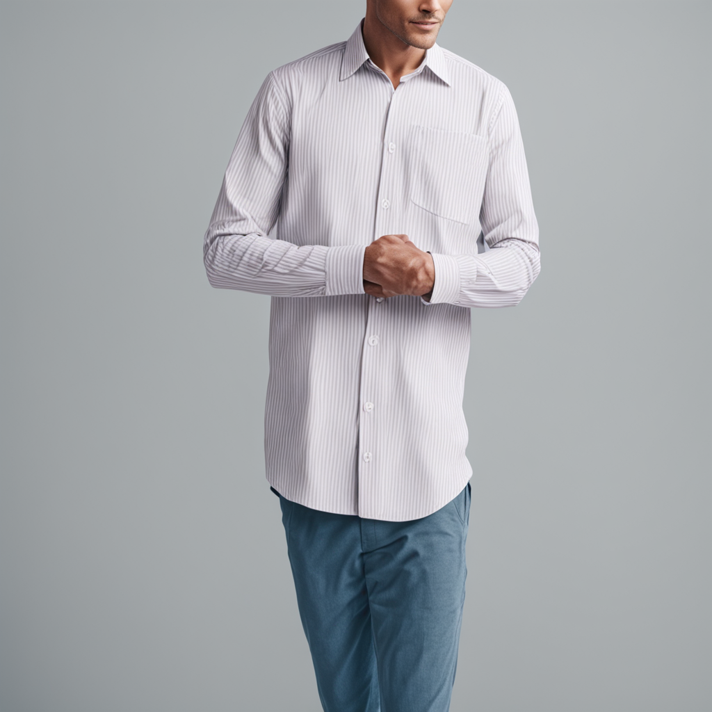

# openpose-controlnet SDXL with custom LoRa

This is a cog implementation of SDXL with LoRa, trained with Replicate's [Fine-tune SDXL with your own images
](https://replicate.com/blog/fine-tune-sdxl).

This is based on [thibaud/controlnet-openpose-sdxl-1.0](https://huggingface.co/thibaud/controlnet-openpose-sdxl-1.0) and [lucataco/cog-sdxl-controlnet-openpose](https://github.com/lucataco/cog-sdxl-controlnet-openpose)

## Example:

Inputs:

"a latina ballerina, romantic sunset, 4k photo"

Output

## Install and run

First, train your custom model (as a LoRa) on [Replicate](https://replicate.com/blog/fine-tune-sdxl). Then when you are happy with the results, clone this repo and modify,

    git clone https://github.com/jschoormans/cog-sdxl-controlnet-openpose/
    cd cog-sdxl-controlnet-openpose/

If required, install cog:

    sudo curl -o /usr/local/bin/cog -L "https://github.com/replicate/cog/releases/latest/download/cog_$(uname -s)_$(uname -m)"
    sudo chmod +x /usr/local/bin/cog

Download the standard weights, and a run a prediction

    cog run script/download-weights 
    cog predict -i image=@demo.jpg -i prompt="a latina ballerina, romantic sunset, 4k photo"

